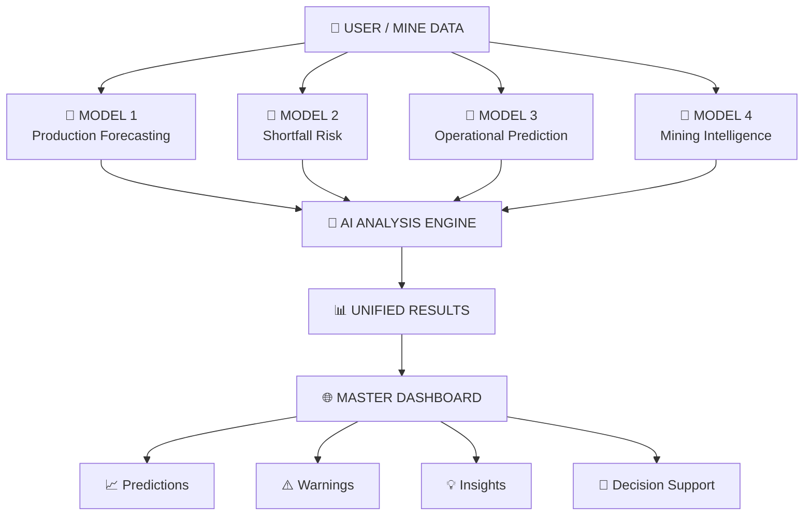
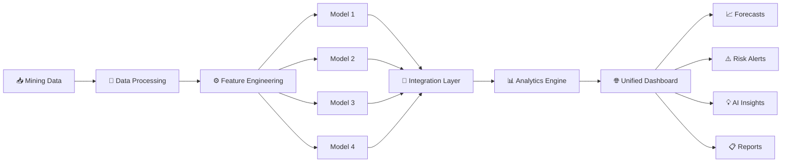
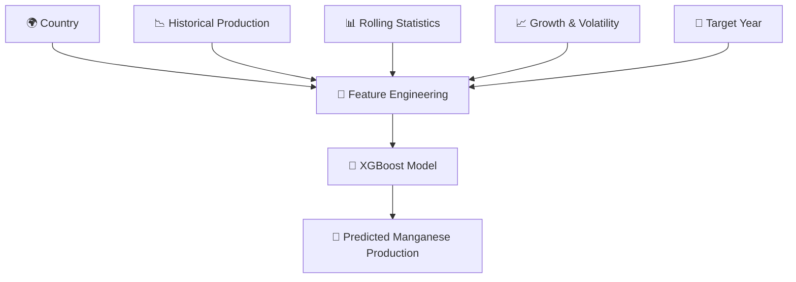
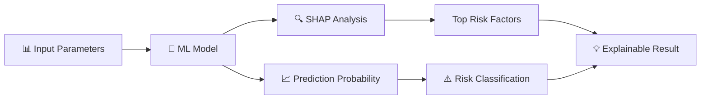
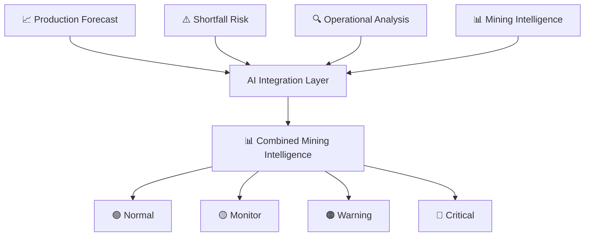
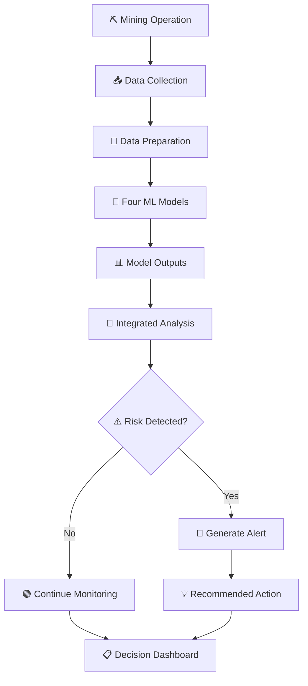
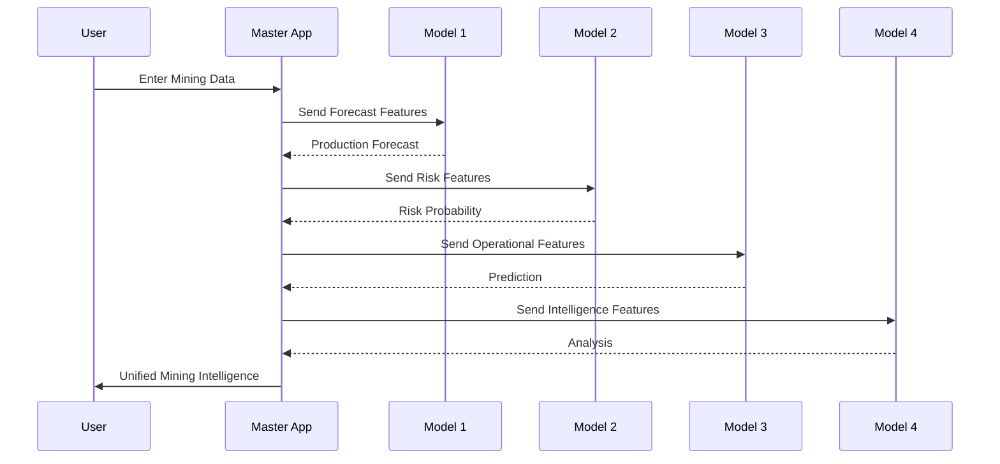
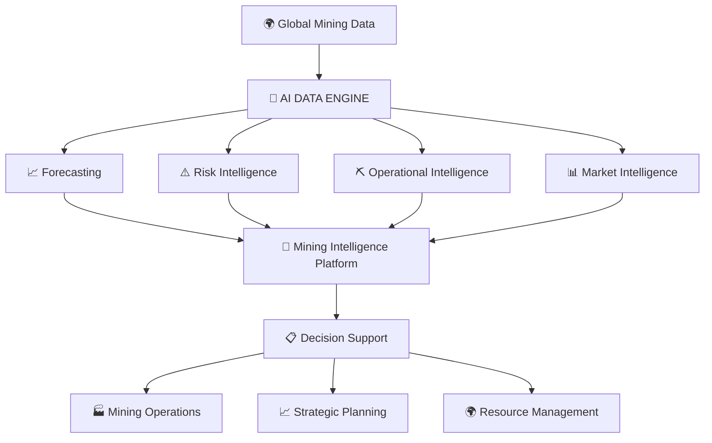

# ⛏️ Mining Intelligence & Forecasting Platform

<p align="center">

### AI-Powered Decision Support System for Mining Operations

**Four specialized Machine Learning models integrated into one intelligent platform for production forecasting, risk analysis, and mining decision support.**

<br>

<a href="https://github.com/AravindInish">

</a>


</p>

---

## 🌍 Overview

The **Mining Intelligence & Forecasting Platform** is an integrated Machine Learning system designed to transform mining data into actionable insights.

Instead of using multiple independent ML applications, this project brings **four specialized predictive models** together under a unified platform.

The system is designed around a simple idea:

> **Collect mining data → Analyze it with specialized AI models → Combine the results → Support better decisions.**

---

# 🎯 Core Objective

The platform aims to provide a centralized intelligence layer for mining operations by combining:

* 📈 Production forecasting
* ⚠️ Shortfall risk prediction
* 🔍 Risk-factor analysis
* 📊 Data-driven operational insights
* 🤖 Machine Learning predictions
* 📋 Unified decision support

---

# 🧠 Four-Model AI Architecture



---

# 🏗️ System Architecture



---

# 🔬 Model Ecosystem

| Model                    | Primary Purpose                      | Output                   |
| ------------------------ | ------------------------------------ | ------------------------ |
| 📈 Production Forecaster | Forecast future manganese production | Predicted production     |
| ⚠️ Shortfall Risk Model  | Estimate shortfall risk              | Probability + risk level |
| 🔍 Operational Model     | Analyze operational/process behavior | Predictive result        |
| 🧠 Intelligence Model    | Support higher-level mining analysis | Decision insights        |

Each model can operate independently while the integrated platform provides a common interface.

---

# 📈 Model 1 — Manganese Production Forecaster

The production forecasting component predicts future manganese production using historical production patterns and engineered features.

### Key inputs

* Previous-year production
* Two-year historical production
* Three-year historical production
* Rolling mean
* Rolling standard deviation
* Growth rate
* Volatility
* Target year
* Country

The existing application loads the trained XGBoost model and constructs the expected feature vector before generating the forecast.

### Forecasting Pipeline



---

# ⚠️ Model 2 — Shortfall Risk Prediction

The shortfall-risk application analyzes mining-process parameters and produces a probability-based risk assessment.

The current implementation uses:

* Historical process data
* Lagged features
* Rolling statistics
* Process parameters
* A trained classifier
* SHAP-based feature analysis

The application assigns four risk levels:

```text
🟢 LOW       → 0% – 30%
🟡 MEDIUM    → 30% – 60%
🟠 HIGH      → 60% – 80%
🔴 CRITICAL  → 80% – 100%
```

These thresholds are defined directly in the current application.

### Important Technical Note

Due to current dataset limitations, this component uses **% Iron Concentrate as a proxy target** rather than directly predicting manganese production shortfall. The application itself explicitly states this limitation.

---

# 🔍 Explainable AI

The shortfall-risk model incorporates **SHAP (SHapley Additive exPlanations)** to identify the most influential factors behind an individual prediction.



The application calculates SHAP values and extracts the top five contributors to the prediction.

---

# 🔗 Integrated Intelligence Layer

The main strength of the project is not simply having four models.

It is the ability to **connect their outputs into one decision-support workflow**.



---

# 🌐 Unified Application

Instead of asking users to open four different applications:

```text
❌ Model 1 → app.py
❌ Model 2 → app.py
❌ Model 3 → app.py
❌ Model 4 → app.py
```

the integrated platform provides:

```text
                    🌐 MASTER APPLICATION
                           │
             ┌─────────────┼─────────────┐
             │             │             │
             ▼             ▼             ▼
        📈 Forecast    ⚠️ Risk       🔍 Analysis
             │             │             │
             └─────────────┼─────────────┘
                           ▼
                    🧠 AI INSIGHTS
```

This creates a much cleaner user experience and provides a single entry point for the complete system.

---

# 📊 Decision-Support Workflow



---

# 🛠️ Technology Stack

### Programming


### Machine Learning


### Data Processing


### Visualization


### Deployment


### Explainable AI


---

# 📁 Recommended Repository Structure

```text
Mining-Intelligence-Platform/
│
├── 📂 models/
│   ├── model_1/
│   │   └── model_1.joblib
│   │
│   ├── model_2/
│   │   ├── model_2.pkl
│   │   ├── preprocessor.pkl
│   │   └── feature_columns.pkl
│   │
│   ├── model_3/
│   │   └── model_3.joblib
│   │
│   └── model_4/
│       └── model_4.joblib
│
├── 📂 apps/
│   ├── model_1_app.py
│   ├── model_2_app.py
│   ├── model_3_app.py
│   └── model_4_app.py
│
├── 📂 integration/
│   ├── model_router.py
│   ├── prediction_engine.py
│   └── feature_pipeline.py
│
├── 📂 assets/
│   └── images/
│
├── 🌐 app.py
├── 📋 requirements.txt
└── 📖 README.md
```

---

# ⚙️ How the Models Work Together

Each pretrained model remains independent.

The integration layer handles:

1. 📥 Collecting user inputs
2. 🧹 Preparing the inputs
3. 🧩 Creating model-specific features
4. 🤖 Sending data to the appropriate model
5. 📊 Collecting predictions
6. 🔗 Combining model outputs
7. 🧠 Generating unified insights
8. 🌐 Displaying everything in one dashboard



---

# 💾 Pretrained Model Architecture

A major advantage of this project is that the models **do not need to be retrained every time the application starts**.

```text
             TRAINING PHASE
                   │
                   ▼
             📊 Mining Data
                   │
                   ▼
             🧠 ML Training
                   │
                   ▼
             💾 Saved Model
                   │
             ┌─────┴─────┐
             ▼           ▼
          .joblib      .pkl
             │           │
             └─────┬─────┘
                   ▼
            🌐 Integrated App
                   │
                   ▼
              🔮 Prediction
```

For example, the production forecasting app loads `xgb_manganese_model.joblib` directly rather than retraining the model at runtime.

## Similarly, the shortfall application loads its trained model, preprocessor, and training-column metadata as saved artifacts.

# 🚀 Getting Started

## 1. Clone the Repository

```bash
git clone https://github.com/AravindInish/your-repository-name.git
cd your-repository-name
```

## 2. Install Dependencies

```bash
pip install -r requirements.txt
```

## 3. Verify Model Files

Make sure all pretrained model artifacts are present:

```text
models/
├── model_1/
├── model_2/
├── model_3/
└── model_4/
```

## 4. Run the Integrated Application

```bash
streamlit run app.py
```

---

# 📊 Example User Journey

```text
STEP 01
👤 User enters mining parameters
             ↓
STEP 02
📊 Platform validates the data
             ↓
STEP 03
🤖 Four ML models process the inputs
             ↓
STEP 04
📈 Forecast + Risk + Analysis generated
             ↓
STEP 05
🧠 Results integrated
             ↓
STEP 06
⚠️ Potential issues identified
             ↓
STEP 07
💡 Decision-support insights displayed
```

---

# 🔮 Future Roadmap

## Phase 1 — Integration

* [x] Develop individual ML models
* [x] Create individual prediction applications
* [ ] Build unified application
* [ ] Centralize model loading
* [ ] Create common input layer

## Phase 2 — Intelligence

* [ ] Cross-model analysis
* [ ] Unified risk score
* [ ] Automated recommendations
* [ ] Explainable AI dashboard
* [ ] Historical prediction tracking

## Phase 3 — Advanced AI

* [ ] LSTM forecasting
* [ ] Transformer-based forecasting
* [ ] Ensemble models
* [ ] Automated hyperparameter optimization
* [ ] Real-time model monitoring

## Phase 4 — Mining Intelligence

* [ ] Commodity-price integration
* [ ] Mineral reserve data
* [ ] Production-demand analysis
* [ ] Supply-chain intelligence
* [ ] Global mining market analysis
* [ ] Interactive world map
* [ ] Real-time mining dashboards

---

# ⚠️ Current Limitations

This platform is currently a **research and prototype decision-support system**.

Important limitations include:

* Model performance depends on the quality and scope of training data.
* Different models may use different datasets and feature pipelines.
* Some model outputs should not be interpreted as direct operational guarantees.
* The current shortfall model uses a proxy target based on Iron Concentrate because of data limitations.
* Real-world mining decisions require additional geological, economic, environmental, operational, and regulatory information.

---

# 🎯 Long-Term Vision

The ultimate goal is to evolve this project from a collection of Machine Learning models into a complete:

# **AI-Powered Mining Intelligence System**



---

# 🏆 Why This Project?

Traditional ML projects often stop at:

> **Train a model → generate a prediction.**

This project takes the next step:

> **Multiple models → integrated intelligence → decision support.**

The goal is to demonstrate how individual Machine Learning models can be transformed into a larger AI system capable of addressing a real-world industrial problem.

---

# 🤝 Contributing

Contributions, ideas, and improvements are welcome.

```bash
git checkout -b feature/new-model
git add .
git commit -m "Add new mining intelligence model"
git push origin feature/new-model
```

Then open a Pull Request.

---

# 📜 Disclaimer

This project is intended for **educational, research, experimentation, and prototype decision-support purposes**.

Predictions should not be treated as guaranteed outcomes or as a substitute for professional mining, geological, engineering, financial, environmental, or regulatory analysis.

---

# 👨‍💻 Author

## **ARAVIND INISH**

Machine Learning | Data Science | AI | Mining Intelligence

Building practical AI systems around real-world problems.

---

<p align="center">

### ⭐ If you find this project useful, consider giving it a star.

**From individual ML models to integrated mining intelligence.**

</p>

<p align="center">


</p>
